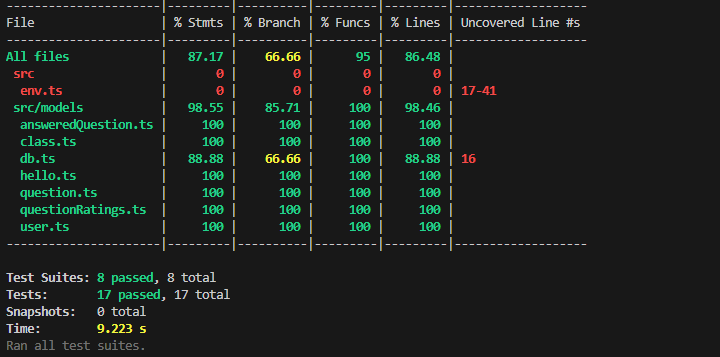

# Rizzlet

### Design

Technical Spec - [Link](https://docs.google.com/document/d/1pt8KaxrR4H4lkDkm3iwLrpPXjrTpsPzHESjQOSDFHxA/edit?usp=sharing)

### Coverage Report

On the backend we have achieved 100% coverage (except for the line in db.ts which will connect to the db defined in .env, which we do not want to do.)



## Contributing

### Install Dependencies

In both `frontend/` and `backend/` run:

```
npm install
```

### Run Locally

In `frontend/` run:

```
npm start
```

In `backend/` run:

```
npm start
```

### Code Style

Please install the recommended VSCode extensions to automatically style the code.

Go to the extensions tab on the left, scroll down and install all workspace recommended extensions
